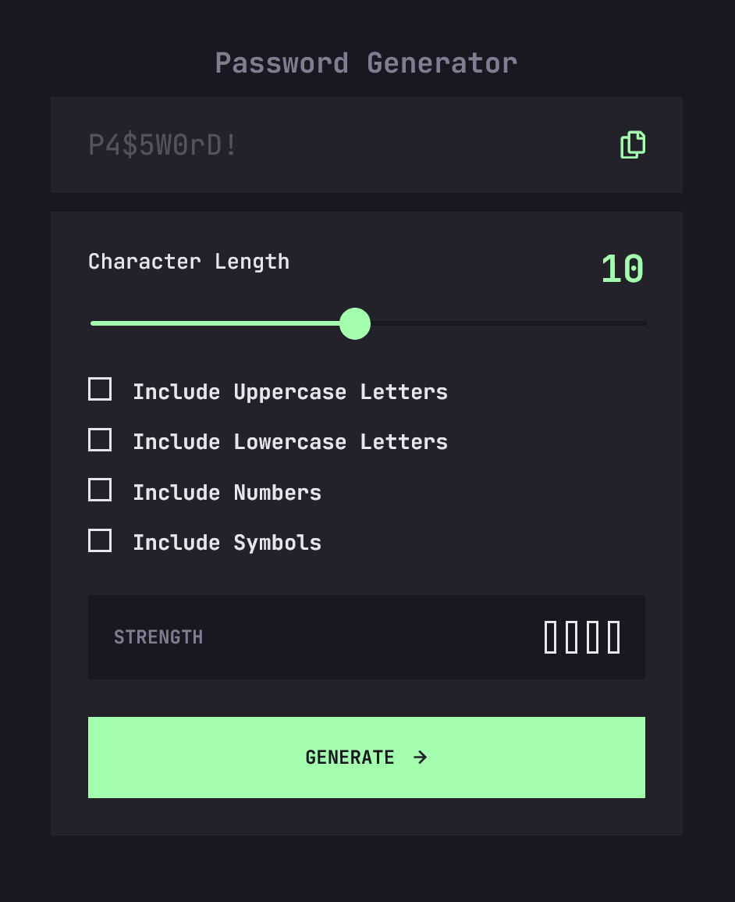
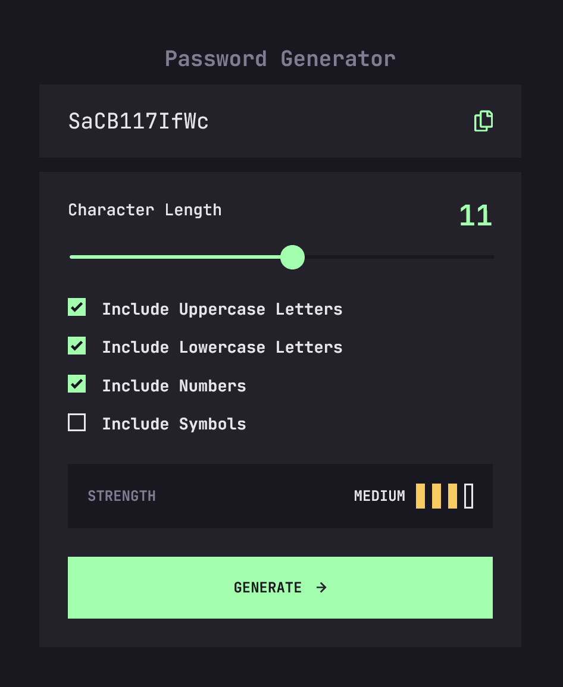

# Frontend Mentor - Password generator app solution

This is a solution to the [Password generator app challenge on Frontend Mentor](https://www.frontendmentor.io/challenges/password-generator-app-Mr8CLycqjh). Frontend Mentor challenges help you improve your coding skills by building realistic projects. 

## Table of contents

- [Overview](#overview)
  - [The challenge](#the-challenge)
  - [Screenshot](#screenshot)
  - [Links](#links)
- [My process](#my-process)
  - [Built with](#built-with)
  - [What I learned](#what-i-learned)
  - [Useful resources](#useful-resources)
- [Author](#author)

## Overview

### The challenge

Users should be able to:

- Generate a password based on the selected inclusion options
- Copy the generated password to the computer's clipboard
- See a strength rating for their generated password
- View the optimal layout for the interface depending on their device's screen size
- See hover and focus states for all interactive elements on the page

### Screenshot




Add a screenshot of your solution. The easiest way to do this is to use Firefox to view your project, right-click the page and select "Take a Screenshot". You can choose either a full-height screenshot or a cropped one based on how long the page is. If it's very long, it might be best to crop it.

### Links

- [Frontend Mentor Solution UR](https://www.frontendmentor.io/solutions/responsive-password-generator-using-vanilla-javascript-vwzXXgHmfg)
- [Live Site URL](https://scintillating-muffin-250ce1.netlify.app/)

## My process

### Built with

- Semantic HTML5 markup
- CSS custom properties
- Flexbox
- CSS Grid
- Mobile-first workflow
- Vanilla JavaScript 


### What I learned

The most challenging aspect of this project was styling the form inputs to match the design comp, particularly the custom range slider used to select the desired password length. I spent hours trying different methods and deciding on which approach to take. Eventually, I settled on a CSS-only approach to avoid using JavaScript to style elements as much as possible. But styling form elements, in general, is not a strength of mine, so I wouldn't have had much hope in achieving this result if not for the outstanding work from [S. Shahriar](https://codepen.io/ShadowShahriar) showcased on Codepen (also linked below). This content was a lifesaver. 

```css
  input[type='range'],
  input[type='range']::-webkit-slider-runnable-track,
  input[type='range']::-webkit-slider-thumb {
    -webkit-appearance: none;
    transition: 200ms all ease-in-out;
    height: var(--thumb-height);
  }

  input[type='range']::-webkit-slider-thumb {
    --thumb-radius: calc((var(--thumb-height) * 0.5) - 1px);
    --clip-top: calc(
      (var(--thumb-height) - var(--track-height)) * 0.5 - 0.5px
    );
    --clip-bottom: calc(var(--thumb-height) - var(--clip-top));
    --clip-further: calc(100% + 1px);
    --box-fill: calc(
        -100vmax - var(--thumb-width, var(--thumb-height))
      )
      0 0 100vmax currentColor;
    width: var(--thumb-width, var(--thumb-height));
    background-color: currentColor;
    box-shadow: var(--box-fill);
    border-radius: var(--thumb-width, var(--thumb-height));
    clip-path: polygon(
      100% -1px,
      var(--clip-edges) -1px,
      0 var(--clip-top),
      -100vmax var(--clip-top),
      -100vmax var(--clip-bottom),
      0 var(--clip-bottom),
      var(--clip-edges) 100%,
      var(--clip-further) var(--clip-further)
    );
  }
```

On the JavaScript side, I used content from [OWASP](https://owasp.org/) to inform my decisions around valid password character sets. I decided on a straightforward JavaScript approach to constructing the password, using an object to reference the available options. I'm no expert on this subject and didn't want to over-complicate the logic involved. 

Note: My initial solution for generating the password fell a little short. I was pooling the selected characters properly to construct a random password, but I overlooked adding the logic to ensure at least one of those chosen character sets was included in the final password generation. Thanks to the Frontend Mentor community, the bug was caught and I went back to revise the function with a more robust solution.

```js
const CHAR_SETS = {
  uppercase: "ABCDEFGHIJKLMNOPQRSTUVWXYZ",
  lowercase: "abcdefghijklmnopqrstuvwxyz",
  numbers: "0123456789",
  symbols: "!\"#$%& '()*+,-./:;<=>?@[\]^_`{|}~"
};

function generatePassword(length, options) {
  let allChars = ""; // build pool of characters from selected options
  let password = ""; // initialize password 
  const selectedChars = []; // initialize array to generate password from
  // Determine which character sets to include in the password, add one character from each set to ensure inclusion
  if (options.uppercase) {
    allChars += CHAR_SETS.uppercase;
    selectedChars.push(CHAR_SETS.uppercase[Math.floor(Math.random() * CHAR_SETS.uppercase.length)]);
  } 
  if (options.lowercase) {
    allChars += CHAR_SETS.lowercase;
    selectedChars.push(CHAR_SETS.lowercase[Math.floor(Math.random() * CHAR_SETS.lowercase.length)]);
  } 
  if (options.numbers) {
    allChars += CHAR_SETS.numbers;
    selectedChars.push(CHAR_SETS.numbers[Math.floor(Math.random() * CHAR_SETS.numbers.length)]);
  } 
  if (options.symbols) {
    allChars += CHAR_SETS.symbols;
    selectedChars.push(CHAR_SETS.symbols[Math.floor(Math.random() * CHAR_SETS.symbols.length)]);
  } 
  // Add the selected characters to the password
  for (let char of selectedChars) {
    password += char;
  }
  // Generate the rest of the password with random characters from the selected character sets
  for (let i = password.length; i < length; i++) {
    const randomIndex = Math.floor(Math.random() * allChars.length);
    password += allChars[randomIndex];
  }
  // Shuffle the password for enhanced randomness
  password = password.split('').sort(() => 0.5 - Math.random()).join('');

  return password;
}
```
My lack of experience in the cyber sec field is also reflected in the logic I used to rate the strength of the generated passwords. It's a pretty rudimentary algorithm based on a handful of existing online tools I played around with, including [The Password Meter](https://passwordmeter.com/).

For the rendering, I felt a switch statement worked best and kept the code easy to understand, allowing me to deal with both the strength rating keywords as well as styling the indicator bars.

```js
function evaluatePasswordStrength(password, options) {
  let score = 0;
  if (password.length >= 8) score += 1;
  if (password.length >= 12) score += 1;
  if (options.uppercase && /[A-Z]/.test(password)) score += 1;
  if (options.lowercase && /[a-z]/.test(password)) score += 1;
  if (options.numbers && /[0-9]/.test(password)) score += 1;
  if (options.symbols && /[!#$%& '()*+,-./:;<=>?@[\]^_`{|}~]/.test(password)) score += 1;
  renderStrengthOutput(score)
}

function renderStrengthOutput(ratingScore) {
  resetStrengthOutput();
  const legend = {};
  switch (ratingScore) {
    case 0:
    case 1:
    case 2:
      legend.ratingLabel = "Too Weak!";
      legend.barCount = 1;
      legend.barColor = 'hsl(0, 91%, 63%)';
      break;
    case 3:
      legend.ratingLabel = "Weak";
      legend.barCount = 2;
      legend.barColor = 'hsl(13, 95%, 66%)';
      break;
    case 4:
      legend.ratingLabel = "Medium";
      legend.barCount = 3;
      legend.barColor = 'hsl(42, 91%, 68%)';
      break;
    default:
      legend.ratingLabel = "Strong";
      legend.barCount = 4;
      legend.barColor = 'hsl(127, 100%, 82%)';
  }

  const styledBars = Array.from(strengthBars).slice(0, legend.barCount);
  strengthRating.textContent = legend.ratingLabel;
  styledBars.forEach(bar => {
    bar.style.backgroundColor = legend.barColor;
    bar.style.borderColor = legend.barColor;
  });
}
```

### Useful resources

- [modernCSSdev](https://moderncss.dev/pure-css-custom-checkbox-style/) - Stephanie Eckles content over at Modern CSS Solutions is one of my go-to resources and this custom checkbox style tutorial was a big help with this project.
- [Range slider for chrome - stackoverflow](https://stackoverflow.com/questions/65738788/input-range-slider-progress-for-chrome-browser) - This is the stackoverflow post that led me to my eventual solution for dealing with the range slider styling for chrome, based heavily on [this codepen](https://codepen.io/ShadowShahriar/pen/zYPPYrQ)


## Author

- Website - [Matt Pahuta](https://www.mattpahuta.com)
- Frontend Mentor - [@mattpahuta](https://www.frontendmentor.io/profile/MattPahuta)
- Bluesky - [@mattpahuta](https://bsky.app/profile/mattpahuta.bsky.social)
- LinkedIn - [Matt Pahuta](www.linkedin.com/in/mattpahuta)
